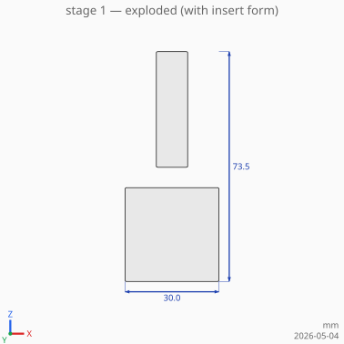
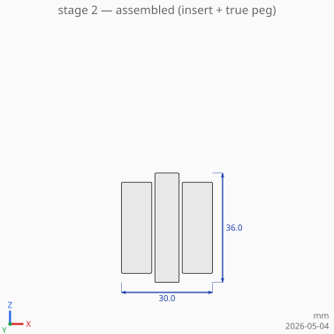
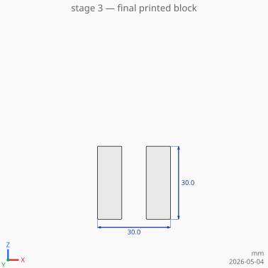

# pkg/parts — composing 3D-printable assemblies

`parts` is a small abstraction for describing physical items — both
**external** (catalogue fasteners, off-the-shelf inserts) and **built**
(parts we 3D-print). Every `Part` exposes two SDF forms:

- **`Shape`** — the true catalogue/CAD geometry. The positive form,
  used for visualisation and as the body of the part itself when it's
  the thing being built.
- **`Insert`** — an oversized version of the same shape, sized for
  clearance when the part is *subtracted* from a host. `Tolerance`
  controls the slack: different printer materials need different fits,
  and so do friction-fit vs sliding-fit applications.

Two assembly helpers turn positioned parts into one composite SDF:

- **`Composite(host, parts, inserts)`** — `host` minus each `Insert`
  shape, plus each `Shape` unioned on top. Use it for as-built
  renderings.
- **`Exploded(host, parts, axis, step)`** — `host` plus each `Shape`
  shifted by `axis · step · (i+1)`. Use it for exploded-view
  diagrams.

## A worked example

We're designing a 30 mm cube that takes a Ø8 mm peg through its
centre. The example uses an exaggerated 2 mm radial tolerance so the
clearance gap is clearly visible in the SVG; in production you'd use
something like `TolerancePLA` (≈0.20 mm).

### Stage 1 — exploded



The block alone, with the peg shown in its **insert** form
(oversized) above where it'll sit. Drawing the exploded peg at insert
size — not at true size — makes it visually obvious that *this is the
volume that will be removed* from the block.

```go
block, _ := parts.Block{Lx: 30, Ly: 30, Lz: 30}.Shape(bld)
peg := parts.Cylinder{R: 4, H: 36}
pegInsert, _ := peg.Insert(bld, parts.Tolerance{Radial: 2, Axial: 1})
pegInsert = bld.Translate(pegInsert, 0, 0, 30) // lift it up for the diagram
result := bld.Union(block, pegInsert)
```

### Stage 2 — assembled



The same parts brought to their final positions via `Composite`. The
peg's insert form is subtracted from the block, leaving a slightly
oversized hole; the peg's true shape is then unioned in, sitting
inside the hole. The cutaway shows a thin annular gap — that's the
2 mm radial tolerance.

```go
result, _ := parts.Composite(bld, block,
    []parts.Placement{ {Part: peg} },                                                // true peg, unioned
    []parts.Placement{ {Part: peg, Tolerance: parts.Tolerance{Radial: 2, Axial: 1}} }, // insert, subtracted
)
```

### Stage 3 — final printed part



What comes off the printer: the block alone, with the peg-shaped
clearance hole. No fastener inside — that gets fitted at assembly
time.

```go
result, _ := parts.Composite(bld, block, nil,
    []parts.Placement{ {Part: peg, Tolerance: parts.Tolerance{Radial: 2, Axial: 1}} },
)
```

## Different parts with different tolerances

Each `Placement` carries its own `Tolerance`, so a single host can
have several inserts at different fits. A typical example: a printed
mount with a tight slip fit on one peg (low tolerance) and a sliding
fit on another (looser).

```go
parts.Composite(bld, mount, nil, []parts.Placement{
    {Part: alignmentPin, Offset: ms3.Vec{X: -10}, Tolerance: parts.ToleranceSLA},
    {Part: thumbScrew,   Offset: ms3.Vec{X:  10}, Tolerance: parts.TolerancePETG},
})
```

## Implementing `Part` for your own type

Two methods. The pattern in `Block` and `Cylinder` is the template:
`Shape` returns the nominal SDF; `Insert` returns the same SDF with
each linear dimension grown by the relevant `Tolerance` field.
`pkg/fasteners.WoodScrew` implements `Part` the same way — see its
`Insert` method for an example with non-trivial geometry (the head
taper grows in proportion so the 90° countersink is preserved).
